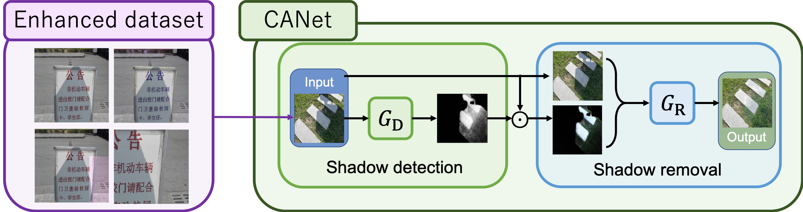
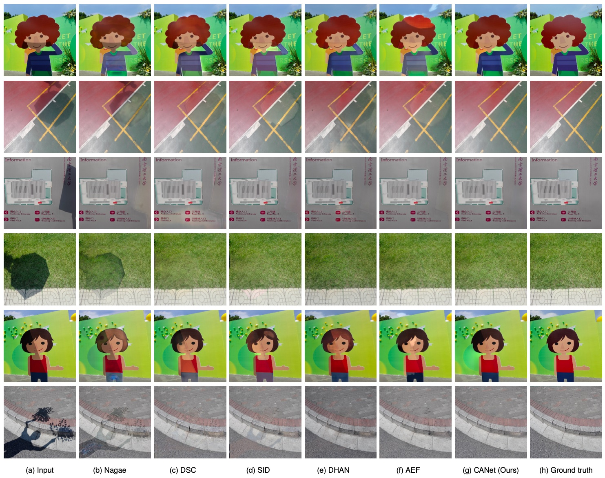

# Channel Attention GAN Trained with Enhanced Dataset for Single-Image Shadow Removal (CANet)

Our paper is going to be published in IEEE Access.
Please refer the paper after publication.



## Datasets
* [ISTD](https://github.com/DeepInsight-PCALab/ST-CGAN) : ST-CGAN
* [SRD](http://www.shengfenghe.com/publications/) : Deshadow-Net
* ISTD+, SRD+  
Datasets are not available but you can create the dataset by applying the [MATLAB code](https://www3.cs.stonybrook.edu/~cvl/projects/SID/index.html) provided by the authors.

## Our results
* ISTD,ISTD+,SRD,SRD+ \[[Google Drive](https://drive.google.com/drive/folders/1up1bfjiB0tRJRcyPdVciokQv9nDzm_7A?hl=ja)\]
* Trained weights \[[Google Drive](https://drive.google.com/drive/folders/1Gw0fpHMtHtfG_d36pBJueajAuEoQ5pBu?usp=sharing)\]

## Create environment with Anaconda
```
conda create -n CANet python=3.8 -y
conda activate CANet
conda init
conda install -c pytorch torchvision=0.10.0 -y
conda install -c conda-forge scikit-image -y
```

## Train
1. Prepare the training dataset.
2. Execute the following command.
```
(This is an example.)

python CANet_train.py \
    --train_name train1 \
    --shadow_dir_path datasets/ISTD/train/train_A \
    --gt_dir_path datasets/ISTD/train/train_C \
    --mask_dir_path datasets/ISTD/train/train_B \
    --mask_edge_dir_path datasets/ISTD/train/train_B_edge \
    --pretrained_d detect_ISTD.pth(optional) \
    --pretrained_r remove_ISTD.pth(optional)
```

## Test
1. Prepare the trained weights.  
Our pre-trained weights can be downloaded from [Google Drive](https://drive.google.com/drive/folders/1Gw0fpHMtHtfG_d36pBJueajAuEoQ5pBu?usp=sharing).
2. Prepare the test images and put them in a single directory. 
3. Execute the following command.
```
python CANet_test.py \
    --detection_pth_path <path of .pth> \
    --removal_pth_path <path of .pth>  \
    --input_img_path <path of directory>
```
4. Directory `output_CANet` is automatically created and the output images are saved here.

## Evaluation
1. Put your results under `results/<dataset name>/<method name>`.  
2. Make sure that the test images are located under `datasets/<dataset name>`.
3. Run the following command.
```
python evaldata.py \
    --method_name <method name> \
    --dataset_name ISTD \
    --resized 1
```

## Directory structure
```
CANet
├── evaldata.py
├── getDatasetPath.py
├── README.md
├── datasets/
│   ├── ISTD/
│       ├── test/
│           ├── test_A/
│               ├── 101.png
│           ├── test_B/
│           ├── test_C/
│       ├── train/
├── results/
│   ├── ISTD/
│       ├── CANet/
│           ├── 101.png
```

## Results
Comparison with the other methods. Please see our paper for the details.


## Citation
We will update here after publication.